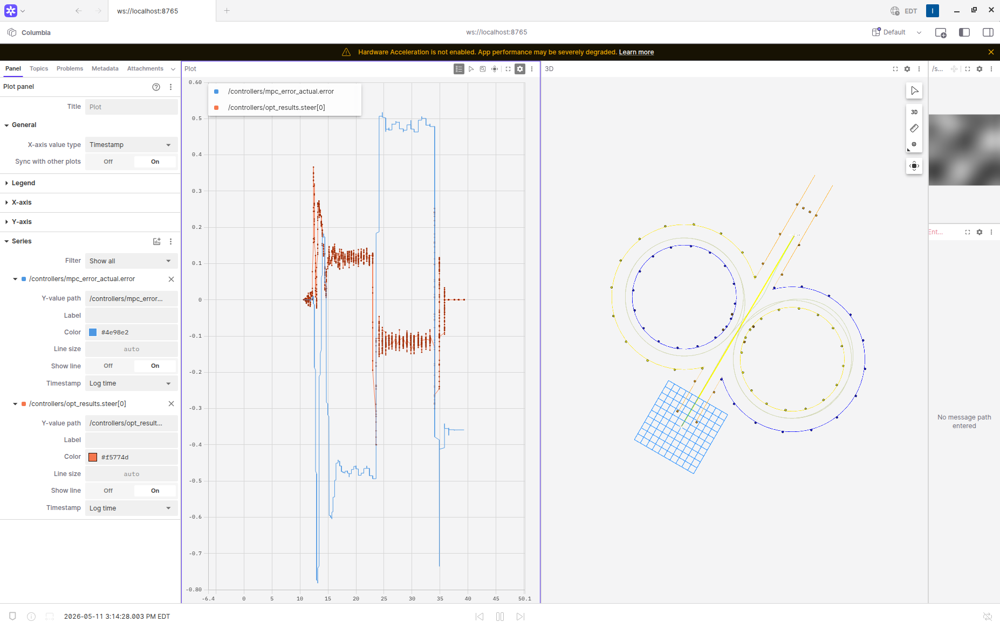

# DUT25 LQR + PID Controller

ROS 2 node implementing discrete-time LQR lateral control and gain-scheduled
PID longitudinal control for the DUT25 Formula Student autonomous car.

Designed as a drop-in replacement for `mpc_python_exec` + `longitudinal_control`
in the DUT25 skidpad pipeline. The goal is a direct performance comparison between
LQR (lower computational cost, fixed operating point) and the existing MPC
(higher computational cost, adaptive LPV formulation).

---

## ROS Interface

| Direction | Topic | Message Type | Description |
|-----------|-------|-------------|-------------|
| Subscribe | `/controllers/opt_requests` | `controller_msgs/OptRequest` | Reference path (N+1 waypoints) + current state x0 |
| Subscribe | `/controllers/accel_request` | `controller_msgs/AccRequest` | Speed setpoint + current speed |
| Publish | `/controllers/opt_results` | `controller_msgs/OptResult` | Predicted steer sequence + trajectory |
| Publish | `/controllers/long` | `controller_msgs/PIDErrors` | Throttle command + PID diagnostics |

`skidpad_manager_node` requires no modification — it reads the same topics
and message types that the MPC uses.

---

## System Model — Lateral (LQR)

Dynamic bicycle model linearized at the skidpad operating speed (11.25 m/s).

**State:** `x = [e_y, e_psi, vy, r, steer]`

| State | Description | Units |
|-------|-------------|-------|
| `e_y` | Lateral deviation from reference path | m |
| `e_psi` | Heading error (vehicle yaw − path heading) | rad |
| `vy` | Lateral velocity | m/s |
| `r` | Yaw rate | rad/s |
| `steer` | Front wheel steering angle | rad |

**Control input:** `u = steering_rate` (dδ/dt) [rad/s]

The LQR gain K is pre-computed at startup for each speed in `vx_schedule`
(default: [3, 5, 7, 9, 11.25] m/s) by solving the Discrete Algebraic Riccati
Equation (DARE). At runtime K is linearly interpolated from the two bracketing
schedule entries using the current measured speed from AccRequest. Speeds below
the lowest schedule entry clamp to the lowest K. This gain scheduling keeps the
controller near-optimal during the acceleration phase into the skidpad circles,
not just at the 11.25 m/s cruise point.

**Vehicle parameters (DUT25):**

| Parameter | Value | Source |
|-----------|-------|--------|
| Mass m | 180 kg | parameters_LPV.yaml |
| Yaw inertia Iz | 294 kg·m² | parameters_LPV.yaml |
| CoG–front axle lf | 0.872 m | wbase × (1 − x_cg) |
| CoG–rear axle lr | 0.658 m | wbase × x_cg |
| Front stiffness Cf | 18 877 N/rad | Interpolated from DUT25 tyre load curve |
| Rear stiffness Cr | 24 293 N/rad | Interpolated from DUT25 tyre load curve |
| Max steer angle | 0.4 rad | parameters_LPV.yaml |
| Max steer rate | 1.3 rad/s | Simulator maximum (DUT25 actual ~4.0 rad/s) |

---

## Curvature Feedforward

The LQR error state is computed relative to speed-dependent steady-state reference values derived from path curvature κ. Without this, K[steer] and K[r] would command a net input opposing the turn at the moment circular motion begins (at circle entry this causes immediate divergence into large-amplitude oscillations).

**κ computation** — estimated from adjacent waypoints at the lookahead index:

```
κ = (θ_{i+1} − θ_i) / ds
```

where θ is the path heading and ds is the arc-length between waypoints (= vx × dt_traj = 0.1125 m at 11.25 m/s).

**Reference signals:**

| Signal | Formula | Notes |
|--------|---------|-------|
| `r_ref` | `vx · κ` | Expected yaw rate — scales linearly with speed |
| `steer_ref` | `−(lf + lr) · κ` | Kinematic steer — **speed-independent** |
| `vy_ref` | `0.2429 · vx · r_ref` | Lateral velocity proxy — scales with vx² · κ |

`steer_ref` does not depend on speed — only on path geometry and wheelbase. `vy_ref` is the steady-state lateral velocity predicted by the bicycle model for circular motion at the current speed.

**Reference values at skidpad circle (κ = 1/7.5 m⁻¹) across gain-schedule speeds:**

| vx [m/s] | r_ref [rad/s] | steer_ref [rad] | vy_ref [m/s] |
|----------|--------------|-----------------|--------------|
| 3.0 | 0.400 | −0.204 | 0.291 |
| 5.0 | 0.667 | −0.204 | 0.810 |
| 7.0 | 0.933 | −0.204 | 1.587 |
| 9.0 | 1.200 | −0.204 | 2.623 |
| 11.25 | 1.500 | −0.204 | 4.099 |

These are the values subtracted from the measured state before applying K. At 11.25 m/s on the skidpad the LQR is tracking a yaw rate of 1.5 rad/s and steering angle of 0.204 rad — without feedforward, both would appear as large error signals driving the wrong correction direction.

**Lookahead mechanism** — `preview_idx = ref_idx + lookahead_steps`. At the current optimum of 40 steps:

- Preview distance: 40 × 0.1125 m = **4.5 m** (≈ 0.4 s at 11.25 m/s)
- The error states (e_y, e_psi) still use the nearest waypoint — only the feedforward references (r_ref, steer_ref, vy_ref) use the preview index

---

## Tuning — LQR (lateral)

All Q/R weights are ROS parameters. Change them in the launch file or a YAML
config; relaunch the node to apply (K is recomputed at startup).

| Parameter | Best (v0.3.7) | Effect / Notes |
|-----------|--------------|----------------|
| `q_e_y` | **4.0** | Lateral tracking tightness. Ceiling at 4.0 for current damping — higher causes oscillation. |
| `q_e_psi` | **1.0** | Heading correction. **Floor is 1.0** — lower causes divergence on C2. Do not adjust. |
| `q_vy` | **5.0** | Lateral velocity damping. 7.0 improves C1 but regresses C2 — net negative. |
| `q_r` | **8.0** | Yaw rate penalty. Raising 4→8 was the clearest single improvement in tuning. |
| `q_steer` | **1.0** | **Dead knob in this regime.** DARE responds <0.5% to changes. Do not adjust. |
| `r_steer_rate` | **1.0** | Control effort penalty. Lowering 1.5→1.0 was the largest single gain (SS offset eliminated). |
| `lookahead_steps` | **40** | Waypoints ahead for curvature feedforward. 40 = 4.5 m preview — primary lever for C2 transient. |

> **Best result (v0.3.7):** C1≈0.76m, SS≈−0.47m, C2≈0.52m at `max_steer_rate=1.3 rad/s`, `lookahead_steps=40`.
> Lookahead feedforward at 40 steps reduced C2 from 7.5m to 0.52m (×14 improvement over baseline).
> The straight-to-circle transition is abrupt (no clothoid), so lookahead >60 pre-steers on the
> approach straight and worsens C1. 40 steps is the current optimum.

---

## Tuning — PID (longitudinal)

Gain parameters match `longitudinal_pid_parameters.yaml` from the DUT25
conventional controller stack. Three gain sets cover low / mid / high speed:

| Parameter | Default | Notes |
|-----------|---------|-------|
| `kp_list` | [4.0, 4.0, 4.0] | Proportional gains per speed range |
| `ki_list` | [1.3, 1.3, 1.3] | Integral gains per speed range |
| `kd_list` | [0.0, 0.0, 0.0] | Derivative gains (disabled — matches baseline) |
| `lower_speed` | 4.0 m/s | Threshold between gain sets 0 and 1 |
| `upper_speed` | 8.0 m/s | Threshold between gain sets 1 and 2 |

---

## DUT25 Integration

### Prerequisites — manual fixes required on a fresh machine

Two packages in the DUT25 repo declare incomplete dependencies, causing
`colcon build` to fail when `lqr_pid_controller` is present. These fixes
are applied directly to the host-mounted files and are **not committed to
the DUT25 repo** — they must be reapplied on any new machine:

```xml
<!-- src/perception_25/pointcloud_processing/package.xml — add inside <package>: -->
<depend>cv_msgs</depend>

<!-- src/state_planning/package.xml — add inside <package>: -->
<depend>controller_msgs</depend>
```

Once applied they persist across container restarts (host-mounted volume).

### Build inside the container

```bash
# Inside Docker container (./run_container.sh)
cd /dut
colcon build --packages-select lqr_pid_controller \
    --packages-skip spinnaker_camera_driver spinnaker_synchronized_camera_driver state_planning
source install/setup.bash
```

### Add LQR mode to the launch system

Edit `src/mission_control/launch/base_pipeline/controllers.launch.xml`
and add a block for `mode == "lqr"` pointing at this package's launch file.

Then launch with:

```bash
ros2 launch simulator simulation.launch.xml \
    mission_name:=skidpad perception:=sim state_estimation:=sim \
    rviz:=false controller_mode:=lqr
```

### Monitoring in Foxglove Studio

Connect to `ws://localhost:8765`. Key topics for LQR vs MPC comparison:

| Topic | Content |
|-------|---------|
| `/controllers/mpc_error_actual` | MPC lateral tracking error (baseline) |
| `/controllers/opt_results` | LQR predicted trajectory + steer sequence |
| `/controllers/long` | Longitudinal PID errors + throttle |
| `/embedded/to/TrajectorySetpoints` | Combined steer + throttle to simulator |
| `/viz/sim/real_car_pose` | Car position for 3D view |

---

## Repository Structure

```
lqr_pid_controller/
  controller_node.py     Main node — LQR lateral + PID longitudinal
launch/
  lqr_pid_controller.launch.py   Launch file with all tuning parameters
CHANGELOG.md             Full change history with dates and times
package.xml              ROS 2 package manifest (version 0.2.0)
setup.py                 Python package entry point
```

---

## Comparison Goals

| Metric | Expected LQR result |
|--------|-------------------|
| Computation time per step | < 1 ms (matrix multiply only) |
| Control frequency | 250 Hz — skidpad_manager publishes OptRequest on every ASControlsEstimations tick (request_interval = 0.004 s); MultiThreadedExecutor prevents accel callbacks from being starved |
| Lateral tracking error | Comparable to MPC on skidpad (constant operating point) |
| Steering smoothness | May show more oscillation than MPC (no constraint handling) |
| Constraint satisfaction | Soft — steer and rate are clamped post-computation |

<p align="center">
  
</p>
